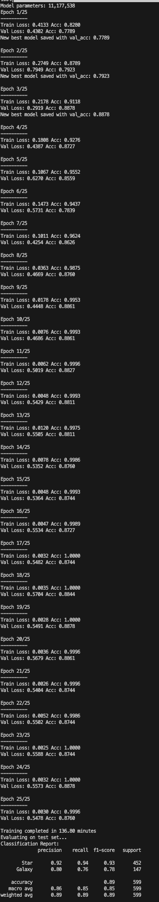

# 🌌 PyTorch Astronomy Classifier

Deep learning classifier for astronomical images using PyTorch and ResNet18.

## 🎯 Features

* **ResNet18 backbone** with transfer learning
* **Comprehensive data augmentation** for training robustness
* **Automatic train/val/test split** (70/15/15)
* **Complete evaluation metrics** with confusion matrix
* **Single image inference** capability
* **Best model checkpointing**

## 📋 Requirements

Install dependencies:

```bash
pip install -r requirements.txt
```

## 📂 Dataset Structure

Organize the [Kaggle Dummy Astronomy Data](https://www.kaggle.com/datasets/divyansh22/dummy-astronomy-data) as:

```
dataset/
├── star/
│   ├── image1.jpg
│   ├── image2.jpg
│   └── ...
└── galaxy/
    ├── image1.jpg
    ├── image2.jpg
    └── ...
```

within `data`.

## ⚡ Quick Start

1. You can either **download dataset** from Kaggle or **run** `configs/extract_dataset.py`
2. **Update data path** in `configs/config.yaml` or **move** it into the `data` folder so that:

   ```yaml
   data_dir: "data/dataset"
   ```
3. **Run training**:

   ```bash
   python astronomy_classifier.py
   ```

## 🔧 Configuration

All hyperparameters and paths are managed via a YAML config file.

Edit the file `configs/config.yaml` to modify training behavior:

```yaml
batch_size: 32
num_epochs: 25
learning_rate: 0.001
step_size: 7
gamma: 0.1
data_dir: "data/dataset"
save_path: "best_astronomy_model.pth"
```

These values are loaded automatically in the script:

```python
import yaml

with open("configs/config.yaml", "r") as f:
    config = yaml.safe_load(f)

BATCH_SIZE = config["batch_size"]
NUM_EPOCHS = config["num_epochs"]
LEARNING_RATE = config["learning_rate"]
```

## 📊 Model Architecture

* **Backbone**: ResNet18 (pre-trained on ImageNet)
* **Input**: 224x224 RGB images
* **Output**: 2 classes (Star, Galaxy)
* **Optimizer**: Adam with StepLR scheduler
* **Loss**: CrossEntropyLoss

## 📈 Results

The model provides:

* Training/validation curves
* Classification report
* Confusion matrix
* Best model saved as `best_astronomy_model.pth`

## 🔍 Inference

Predict single images through `inference.py`:

```bash
python inference.py --image <image_path>
```

## 🚀 Performance

It has taken \~2+ hours for training time in my personal computer (CPU — 8GB RAM). 

### Overall info

* **Training time**: \~10-15 minutes (GPU)
* **Expected accuracy**: 85-95% on test set
* **Model size**: \~45MB
* **Parameters**: \~11M

## 🛠️ Hardware tips

* **Minimum**: 4GB RAM, CPU training possible
* **Recommended**: 8GB+ RAM, NVIDIA GPU with CUDA
* **Storage**: \~500MB for dataset + models

---

> **Appendix**
>#### *Trained AstroCNN Model Data*
> 